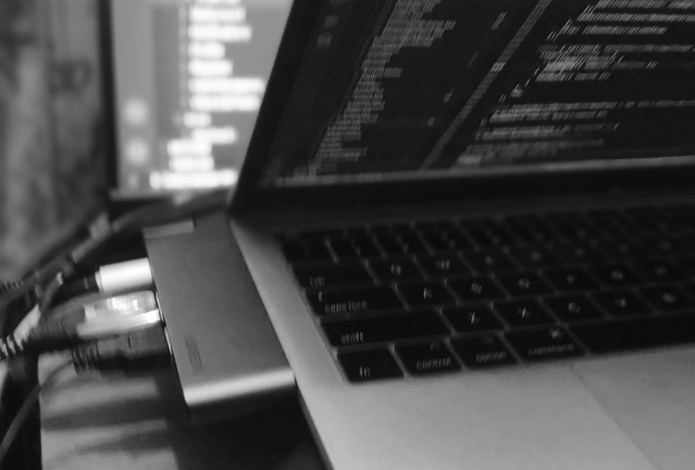
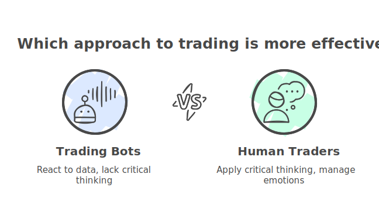
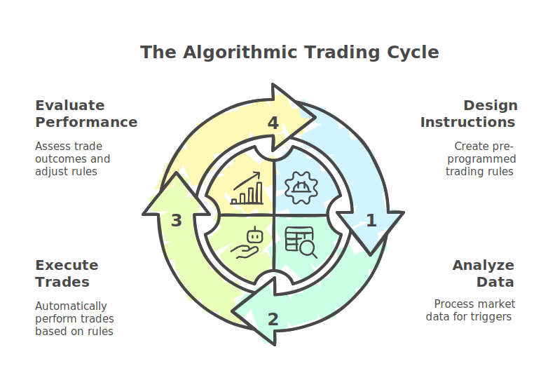
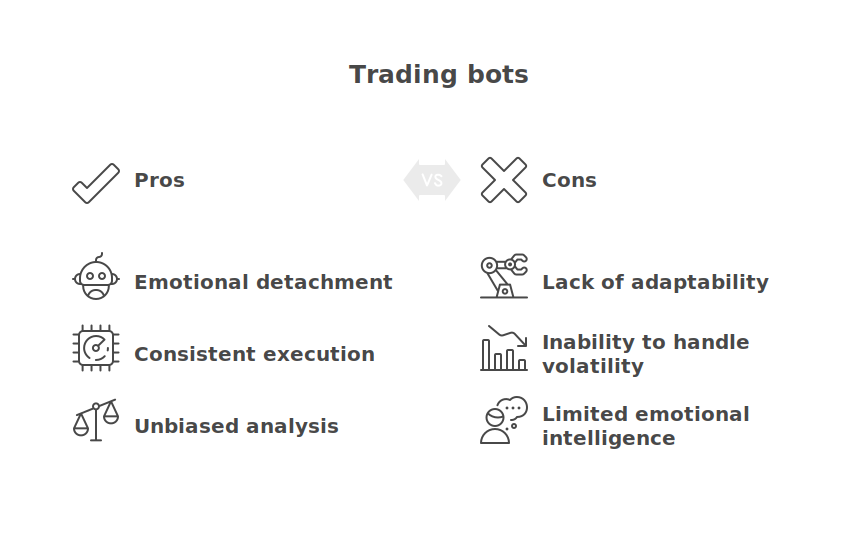
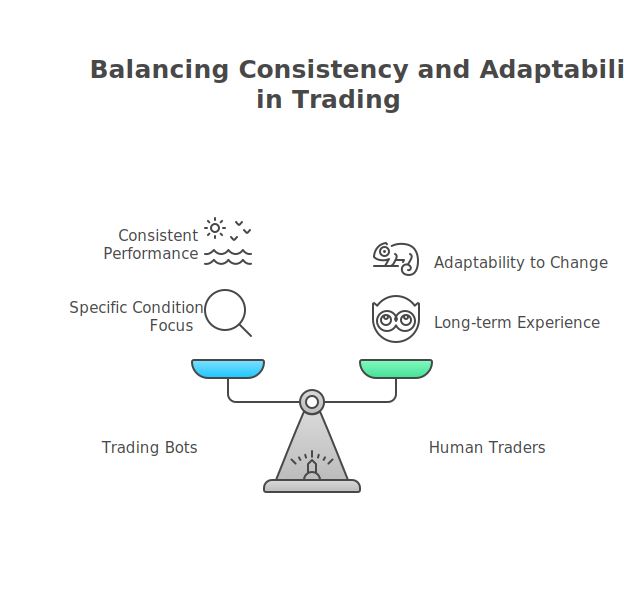

## Can a Trading Bot Really Beat the Market? – A Realistic Look
### **Introduction: The Perception vs. Reality**

We’ve all heard it – trading bots are portrayed as superior to human traders. The image of a flawlessly programmed algorithm consistently outperforming the market is a powerful one. However, beneath this romanticized view lies a crucial truth: true market mastery isn’t about speed or sophistication. The reality is that trading bots, at their core, are sophisticated tools reacting to data, not thinking critically.  Let’s delve into why this perception exists and explore why truly beating the market is incredibly challenging, even for the most advanced bots. 

### **Understanding the Limitations of Algorithmic Trading**

Algorithmic trading, at its simplest, is a set of pre-programmed instructions that execute trades automatically. These instructions are designed to react to specific market conditions, price fluctuations, or other triggers. The brilliance of a bot lies in its ability to process information and execute trades based on those triggers with remarkable speed.  However, this speed is predicated on meticulous design and perfectly executed code.  A human trader, on the other hand, can incorporate intuition, experience, and a complex understanding of market nuances—things that are inherently difficult to codify.  

The foundation of almost all algorithmic trading is a sophisticated data feed, constantly analyzing price, volume, and other variables. The bot then executes trades based on pre-determined rules and risk parameters.  It’s a powerful system, but it lacks the contextual awareness and adaptability that a human trader possesses.  Think of it like a well-oiled machine; it executes instructions flawlessly, but it doesn't *understand* the purpose of those instructions. 

### **The Role of Emotional Factors – The Biggest Hurdle**

While a bot can flawlessly replicate a trading strategy, it’s crucial to recognize that emotions—fear and greed—play a significant role in market decisions, regardless of the trading system employed.  Human traders often react to news, market trends, and personal feelings, leading to impulsive decisions that can quickly erode profits. A bot, operating within its programmed parameters, doesn't experience these emotional fluctuations. It simply executes the next instruction based on its analysis. 

This lack of emotional control is a critical weakness.  Market volatility, unexpected events, and unpredictable patterns are all more easily navigated by a human trader. The emotional response can often trigger suboptimal trading decisions. While some bots incorporate safeguards, they’re far less effective at mitigating the impact of human sentiment than a skilled trader. 

### **Consistency vs. Breakthroughs**

The claim of a bot "beating the market" is often associated with consistently generating returns exceeding a certain benchmark. However, consistency alone isn’t a guarantee of success.  Many bot strategies are designed for specific conditions and can struggle to maintain performance across broader market fluctuations.  The market is inherently noisy, and the best bots are often excellent at *consistent* performance within a defined range, rather than achieving consistently spectacular gains.

Furthermore, the concept of "beating the market" is often a moving target.  Historically, market returns have been relatively stable over time.  The challenge for a bot is not simply to outperform; it’s to maintain that advantage over long-term, fluctuating trends.  A truly successful trading bot must be able to adapt to changing market dynamics—a human trader’s experience is invaluable in this regard. 

### **Final Thoughts:  The Power of Human Judgment**

Ultimately, while algorithmic trading offers incredible potential, it doesn't inherently "beat the market." The best traders, and the most successful bot strategies, rely on human judgment, market intuition, and the ability to adapt to unforeseen circumstances.  The pursuit of automated dominance is a worthwhile goal, but recognizing the limitations of algorithmic trading – particularly the importance of emotional control – is the first step toward a more realistic understanding of long-term success.  Instead of focusing on *beating* the market, a more sustainable approach is to build a trading system that consistently demonstrates edge in a specific, well-defined environment.
    