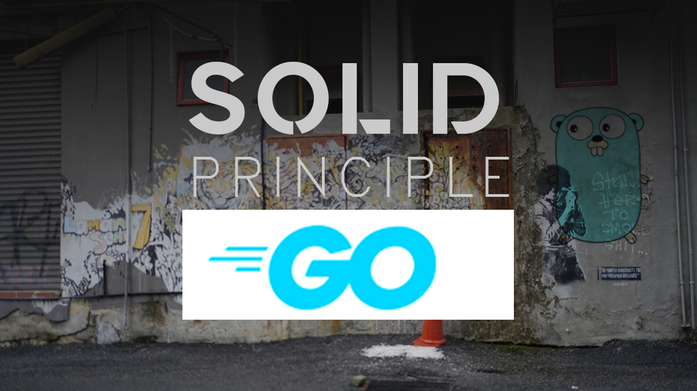

Imagine this: you’re in the middle of an epic coding session, coffee mug half-empty, and your trading bot is spitting out errors like a grumpy cat. You scream internally, "Why did I write this tangled mess of code?!" Been there, done that. But what if I told you there’s a way to avoid this nightmare? Enter SOLID principles, your coding safety net. Let’s explore how these principles can turn your automated trading bot into a masterpiece of maintainability and scalability.


## **1\. Single Responsibility Principle (SRP)**

### **"One Job, Dude. Just One Job."**

Picture this: your trading bot is like a team of specialists. Each part has its expertise. The data fetcher doesn’t care about executing trades, and the trade executor isn’t losing sleep over market analysis. That’s SRP in action.

**Example:**

```go
// SRP: Separate data fetching logic

package datafetcher

type DataFetcher interface {
    FetchMarketData(symbol string) (MarketData, error)
}

type MarketData struct {
    Price float64
    Volume float64
}


// SRP: Separate strategy logic
package strategy

import "yourproject/datafetcher"

type Strategy interface {
    Evaluate(data datafetcher.MarketData) (bool, error)
}


// SRP: Separate order execution
package executor

import "yourproject/strategy"

type Executor interface {
    ExecuteTrade(strategy strategy.Strategy) error
}
```

By giving each component a single job, debugging becomes as easy as finding Waldo in a room full of Oompa-Loompas.

---

## **2\. Open/Closed Principle (OCP)**

### **"Extend It, Don’t Break It."**

Your bot starts simple: one strategy, one order type. Then you get ambitious. New strategies, multiple order types—chaos, right? Not with OCP.

**Example:**

```go
// Define an interface for strategies

package strategy

type Strategy interface {
    Execute(symbol string) (bool, error)
}


// Implement multiple strategies
package strategies

import "yourproject/strategy"

type MACDStrategy struct {}

func (s MACDStrategy) Execute(symbol string) (bool, error) {
    // MACD logic
    return true, nil
}

type RSIOverboughtStrategy struct {}

func (s RSIOverboughtStrategy) Execute(symbol string) (bool, error) {
    // RSI logic
    return false, nil
}

// Add new strategies without touching existing ones!
```

Now, you’re adding features without praying your bot doesn’t implode.

---

## **3\. Liskov Substitution Principle (LSP)**

### **"Swap It Like It’s Hot."**

Ever tried switching out a part only to realize it breaks everything? LSP ensures you can swap components without chaos.

**Example:**

```go
package broker

type Broker interface {
    PlaceOrder(symbol string, volume float64, orderType string) error
}


// Binance implementation
package binance

import "yourproject/broker"

type BinanceBroker struct {}

func (b BinanceBroker) PlaceOrder(symbol string, volume float64, orderType string) error {
    // Binance API logic
    return nil
}


// MT5 implementation
package mt5

import "yourproject/broker"

type MT5Broker struct {}

func (m MT5Broker) PlaceOrder(symbol string, volume float64, orderType string) error {
    // MT5 API logic
    return nil
}


// Use brokers interchangeably
func Trade(b broker.Broker, symbol string, volume float64) error {
    return b.PlaceOrder(symbol, volume, "BUY")
}
```

Whether you’re trading Bitcoin or gold, your code is ready.

---

## **4\. Interface Segregation Principle (ISP)**

### **"No Bloat, No Problem."**

Interfaces shouldn’t feel like Thanksgiving dinner—bloated and hard to handle. ISP keeps things lean.

**Example:**

```go
package notifier

type EmailNotifier interface {
    SendEmail(subject, body string) error
}


type SMSNotifier interface {
    SendSMS(message, phoneNumber string) error
}


// Implement only what’s needed
package notifications

type TradeNotifier struct {}

func (t TradeNotifier) SendEmail(subject, body string) error {
    // Email logic
    return nil
}

// SMS logic isn’t needed for this implementation
```

Focus your interfaces like a laser, not a disco ball.

---

## **5\. Dependency Inversion Principle (DIP)**

### **"Abstract All the Things."**

Dependencies should work for you, not the other way around. DIP keeps your code flexible.

**Example:**

```go
package tradingbot

import "yourproject/broker"

import "yourproject/strategy"

type Bot struct {
    Broker   broker.Broker
    Strategy strategy.Strategy
}


func (b Bot) Run(symbol string) error {
    decision, err := b.Strategy.Execute(symbol)
    if err != nil || !decision {
        return err
    }
    return b.Broker.PlaceOrder(symbol, 1.0, "BUY")
}


// Inject dependencies
package main

import (
    "yourproject/binance"
    "yourproject/strategies"
    "yourproject/tradingbot"
)


func main() {
    bot := tradingbot.Bot{
        Broker:   binance.BinanceBroker{},
        Strategy: strategies.MACDStrategy{},
    }
    bot.Run("BTCUSDT")
}
```

Now, you can swap brokers or strategies like you’re changing outfits for a party.

---

## **Conclusion**

The SOLID principles aren’t just buzzwords; they’re the Avengers of coding practices, ready to save your bot from disaster. With Golang as your hammer, these principles ensure your trading bot is:

1. Easy to debug.
    
2. Ready to scale.
    
3. Resilient to change.
    

So, go forth and code responsibly. And remember, the only thing worse than spaghetti code is cold spaghetti. What’s your favorite SOLID principle? Share your thoughts (or war stories) in the comments—let’s trade ideas like we trade stocks!