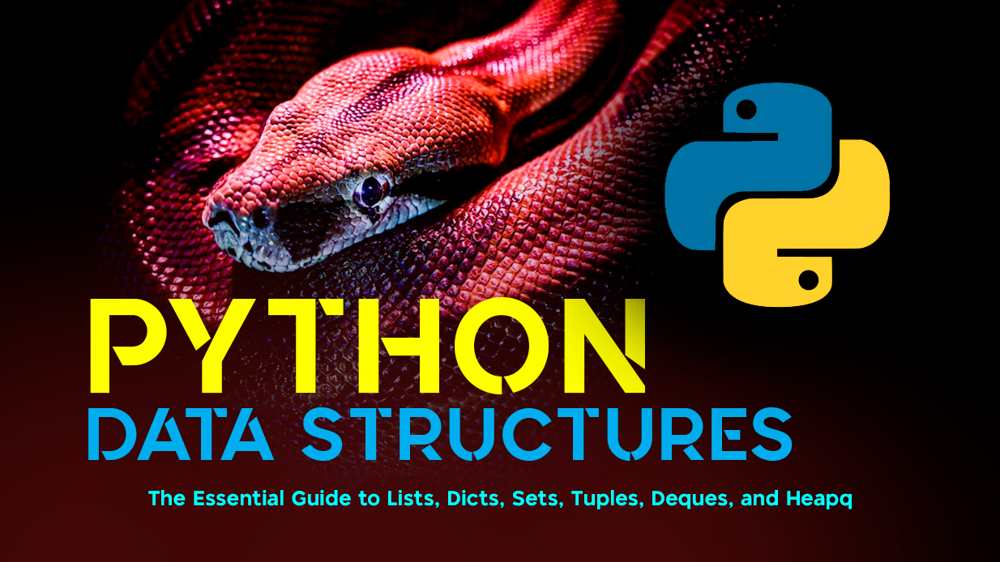

When you dive into Python, one of the most powerful tools at your disposal is its built-in data structures. They shape how you store, organize, and manipulate information. But not all data structures are created equal, and knowing when to use which can save you time, memory, and bugs.


## 1. Lists: The Swiss Army Knife

A list is an ordered, mutable collection. Perfect for when you need an indexable sequence of elements that can grow or shrink dynamically.
```python
fruits = ["apple", "banana", "cherry"]
fruits.append("mango")
print(fruits)  # ['apple', 'banana', 'cherry', 'mango']

prices = [100, 200, 300, 400]
prices.append(500)     # Add to end
prices.insert(1, 150)  # Insert at position 1
prices.remove(300)     # Remove specific value
print(prices)          # Output: [100, 150, 200, 400, 500]
print(prices[0])       # Access first element: 100

```
When to Use Lists:
- You need an ordered sequence.
- You’ll frequently add, remove, or modify elements.
- You want random access via indexing.

Python lists are implemented as dynamic arrays, so appending at the end is amortized `O(1)`, but inserting/removing in the middle is `O(n)`.

## 2. Dicts: Fast Lookups with Key-Value Pairs

Dictionaries store data as key-value pairs and provide O(1) average lookup time thanks to hashing.
```python
prices = {"apple": 2, "banana": 1}
print(prices["apple"])  # 2

phone_book = {"Alice": "1234", "Bob": "5678"}
phone_book["Charlie"] = "91011"    # Add key-value pair
print(phone_book["Alice"])         # Access value by key: 1234
del phone_book["Bob"]              # Delete key
print(phone_book)                  # Output: {'Alice': '1234', 'Charlie': '91011'}

```
When to Use Dicts:
- You need to map relationships between keys and values.
- You need fast retrieval by key.
- You want flexible, dynamic collections.

Modern Python dicts also maintain insertion order (since Python 3.7+), so iterating respects the order of insertion.

## 3. Sets: Unique and Unordered

A set stores unique elements and allows quick membership tests.
```python
unique_nums = {1, 2, 3, 3}
print(unique_nums)  # {1, 2, 3}
print(2 in unique_nums)  # True

a = {1, 2, 3, 4}
b = {3, 4, 5, 6}
print(a | b)   # Union: {1, 2, 3, 4, 5, 6}
print(a & b)   # Intersection: {3, 4}
print(a - b)   # Difference: {1, 2}

```
When to Use Sets:
- You need to eliminate duplicates.
- You need fast membership checks.
- You want to perform set operations like union, intersection, difference.

Sets are implemented as hash tables under the hood, providing O(1) average lookup and insertion.

## 4. Tuples: Immutable Lists
Tuples are like lists, but immutable. They are ordered and hashable (if containing hashable elements), making them great for fixed data and as dict keys.
```python
coordinates = (10.5, 20.8)
print(coordinates[0])  # Access first value: 10.5
# coordinates[0] = 5   # ERROR: Tuples are immutable

```
When to Use Tuples:
- The data should never change.
- You need fixed-length, ordered collections.
- You need an immutable key for dicts or sets.

Since tuples are immutable, they can be more memory-efficient and slightly faster than lists.

## 5. Deques: Fast Appends and Pops

collections.deque is a double-ended queue, optimized for fast appends and pops on both ends (O(1)).
```python
from collections import deque
dq = deque([1, 2, 3])
dq.append(4)       # Add to right
dq.appendleft(0)   # Add to left
dq.pop()           # Remove from right
dq.popleft()       # Remove from left
print(dq)          # Output: deque([1, 2, 3])
```
When to Use Deques:
- You need a queue or stack with fast pops and appends.
- Implementing sliding window algorithms.
- Handling FIFO/LIFO operations efficiently.

Unlike lists, popping from the left is O(n) in lists but O(1) in deques.

## 6. Heapq: Priority Queues Made Easy

heapq provides a min-heap implementation using lists.
```python
import heapq
nums = [5, 1, 8, 3]
heapq.heapify(nums)         # Convert list into a heap
heapq.heappush(nums, 0)     # Push new element
smallest = heapq.heappop(nums)  # Pop smallest element
print(smallest)             # Output: 0
print(nums)                 # Heap internally arranged
```
When to Use Heapq:
- You need priority queues.
- Efficiently find smallest/largest n elements.
- Implementing Dijkstra’s algorithm or task schedulers.

Operations like heappush and heappop run in O(log n), making heaps ideal for maintaining ordered priorities.

Choosing the Right Data Structure

Picking the right data structure can dramatically improve performance and code clarity:
- Need order and flexibility? Use lists.
- Need fast lookups and mapping? Use dicts.
- Need uniqueness and set operations? Use sets.
- Need fixed immutable data? Use tuples.
- Need fast pops on both ends? Use deques.
- Need priority queues? Use heapq.

## Conclusion

By mastering these built-in data structures, you’ll write Pythonic, efficient, and cleaner code. The right choice is often the difference between code that struggles and code that scales.