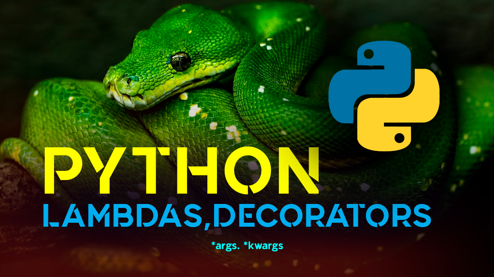

## Introduction
Functions are the lifeblood of any programming language. They allow us to abstract, reuse, and modularize code. But Python takes functions further than many languages—turning them into flexible, dynamic tools that can adapt to a wide variety of situations.


Today, we’ll explore three of Python’s most powerful (and sometimes misunderstood) function features:

1. Lambda functions (anonymous functions)
2. Decorators (functions that modify other functions)
3. `*args` and `**kwargs` (flexible arguments)

We’ll unravel not only how to use them, but why they matter, and the subtle gotchas you need to know.

## Lambdas: Tiny but Mighty

In most programming tutorials, lambdas are introduced as "one-line anonymous functions." While technically true, that undersells their usefulness.

**What is a Lambda?**

A lambda is essentially a small function without a name. You define it with the keyword `lambda`:
```python
# Regular function definition
def square(x):
    return x ** 2

# Lambda function equivalent
square_lambda = lambda x: x ** 2

print(square_lambda(5))  # Output: 25
```

> Commentary: The lambda version eliminates the need for a def and works inline. Useful for quick operations where defining a full function would feel heavy.

**Why use Lambdas?**
- Great for short-lived functions (e.g., sorting keys, mapping, filtering).
- Keep code concise where verbosity isn’t necessary.
- Pair beautifully with functional tools like `map`, `filter`, and `reduce`.

Example:
```python
# Using lambda with sorted to sort by length of strings
words = ["apple", "kiwi", "banana", "cherry"]
sorted_words = sorted(words, key=lambda w: len(w))

print(sorted_words)  
# Output: ['kiwi', 'apple', 'banana', 'cherry']
```

> Commentary: Instead of defining a separate function to sort by length, we just define it inline. It’s clean and expressive.

**Lambda Gotchas**
- Limited to single expressions (no multi-line statements).
- Overuse makes code hard to read—don’t try to cram too much logic inside.

## Decorators: Functions That Wrap Other Functions
Here’s where Python really flexes its functional programming muscles. Decorators allow you to modify the behavior of functions without changing their source code.

**What is a Decorator?**
A decorator is simply a function that takes another function as input, adds some behavior, and returns a new function.

Example:
```python
def my_decorator(func):
    def wrapper():
        print("Before the function runs")
        func()
        print("After the function runs")
    return wrapper

@my_decorator
def greet():
    print("Hello!")

greet()
```

Output:
```bash
Before the function runs
Hello!
After the function runs
```

> Commentary: The `@my_decorator` syntax is just shorthand for `greet = my_decorator(greet)`. Python syntactic sugar makes this pattern elegant.

**Why use Decorators?**

- Logging and monitoring
- Caching results (e.g., functools.lru_cache)
- Authentication checks in web frameworks
- Timing function execution

Example: Timing a Function
```python
import time

def time_it(func):
    def wrapper(*args, **kwargs):
        start = time.time()
        result = func(*args, **kwargs)
        end = time.time()
        print(f"{func.__name__} took {end - start:.4f} seconds")
        return result
    return wrapper

@time_it
def compute_squares(n):
    return [x ** 2 for x in range(n)]

compute_squares(1_000_000)
```

> Commentary: The decorator wraps the function to measure how long it takes without touching the function logic itself.

## *args and **kwargs: The Function Shape-Shifters

Sometimes you don’t know ahead of time how many arguments your function will need. Python provides `*args` and `**kwargs` for that.

`*args` Explained
- Allows you to pass a variable number of positional arguments to a function.

Example:
```python
def add_all(*args):
    return sum(args)

print(add_all(1, 2, 3))     # 6
print(add_all(5, 10, 15, 20)) # 50
```

> Commentary: args is a tuple containing all extra positional arguments.

`**kwargs` Explained

- Allows you to pass a variable number of keyword arguments (like dictionaries).

Example:
```python
def print_person_info(**kwargs):
    for key, value in kwargs.items():
        print(f"{key}: {value}")

print_person_info(name="Alice", age=30, job="Engineer")
```

Output:
```bash
name: Alice
age: 30
job: Engineer
```

> Commentary: kwargs becomes a dictionary containing keyword arguments.

Combining *args and **kwargs

You can use them together:
```python
def demo_func(a, b, *args, **kwargs):
    print("a:", a)
    print("b:", b)
    print("args:", args)
    print("kwargs:", kwargs)

demo_func(1, 2, 3, 4, x=10, y=20)
```

Output:
```bash
a: 1
b: 2
args: (3, 4)
kwargs: {'x': 10, 'y': 20}
```

> Commentary: *args collects extra positionals, **kwargs collects extra keyword args. Great for APIs where flexibility is key.

**Advanced Example: Combining Everything**

Let’s combine lambdas, decorators, and flexible arguments into one scenario:

Imagine a function that takes a list, applies a transformation, and times it:
```python
import time

# Decorator to time functions
def time_it(func):
    def wrapper(*args, **kwargs):
        start = time.time()
        result = func(*args, **kwargs)
        end = time.time()
        print(f"{func.__name__} took {end - start:.4f} seconds")
        return result
    return wrapper

@time_it
def transform_and_filter(data, transform=lambda x: x, filter_fn=lambda x: True):
    """
    Apply a transform and filter function to the data.
    - transform: function to modify data (default: identity)
    - filter_fn: function to filter data (default: keep all)
    """
    return [transform(x) for x in data if filter_fn(x)]

nums = list(range(10))
# Double numbers, but only keep even ones
result = transform_and_filter(nums, transform=lambda x: x*2, filter_fn=lambda x: x % 2 == 0)
print(result)
```

Explanation:
- `@time_it` decorates `transform_and_filter` to time execution.
- `transform` and `filter_fn` are lambdas to customize logic.
- `*args/**kwargs` make the decorator flexible regardless of parameters.

## Gotchas and Best Practices

- Don’t abuse lambdas: Use them for simple, one-line functions. Beyond that, define proper functions for readability.

- Be careful with decorators: They can obscure the original function signature. Use `functools.wraps` to preserve metadata.

- Watch argument order: When combining arguments, order must be:
`def func(positional, *args, keyword, **kwargs)`

## Conclusion

Python functions are far more than `def` statements. With lambdas, decorators, and flexible arguments, you gain tools for writing concise, adaptable, and reusable code. These features unlock functional programming patterns that make your Python projects elegant and powerful.

Mastering them gives you a significant edge, whether you’re optimizing data pipelines, building APIs, or writing algorithms.