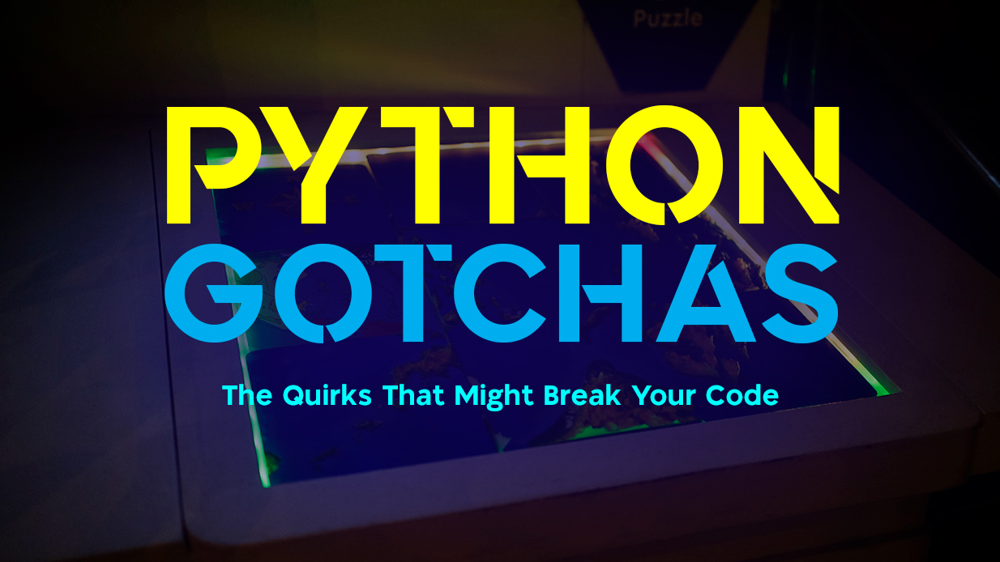

Python is loved for being simple, elegant, and beginner-friendly. It’s the language that promises: “Don’t worry, you’ll be productive in no time.” But lurking beneath that clean syntax are little landmines—quirks of design, history, and human psychology—that can trip up even experienced developers. These are **Python’s gotchas**.

And once you hit them, you’ll never forget them.

Let’s unpack some of the most notorious ones, and more importantly, why they exist. Because like many things in programming, Python’s weirdness usually comes from good intentions… gone slightly sideways.


## 1. Default Mutable Arguments – The Time Traveler Bug

You write a function with a default list parameter:
```python
def add_item(item, container=[]):
    container.append(item)
    return container
```

Seems harmless. You call it:
```python
print(add_item("apple"))  # ['apple']
print(add_item("banana")) # ['apple', 'banana'] ???
```

Wait. Why is banana in the same basket as apple?

The reason is that Python evaluates default arguments once, at function definition time, not each call. That list isn’t reset—it’s the same list, carried through time.

It’s like opening a fresh lunchbox every day, but realizing it’s the same one you used yesterday, complete with leftover sandwiches.

The fix? Use None as a default and create a new list inside:
```python
def add_item(item, container=None):
    if container is None:
        container = []
    container.append(item)
    return container
```
## 2. `is` vs `==` – When Identity and Equality Collide

Let’s test this:
```python
a = 256
b = 256
print(a is b)  # True
```

Okay, so numbers are the same object. Then:
```python
c = 257
d = 257
print(c is d)  # False
```

Wait, what?

The explanation: Python caches small integers (from -5 to 256). It’s an optimization. So a and b literally point to the same memory object. But outside that range, new integers are created.

It’s not magic—it’s just the interpreter trying to be efficient.

Lesson: Use `==` for equality, is for identity. Unless you want to end up debating philosophy with your code.

## 3. Floating Point Arithmetic – The Infinite Decimal Trap
```python
print(0.1 + 0.2 == 0.3)  # False
```

The first time you see this, you probably check your glasses. But the problem isn’t Python—it’s math on binary computers.

0.1 and 0.2 can’t be perfectly represented in base 2, so you get rounding errors. Python just exposes it honestly.

The fix? Use decimal for precision, or round() for sanity:
```python
from decimal import Decimal
print(Decimal("0.1") + Decimal("0.2") == Decimal("0.3"))  # True
```
## 4. The Late Binding Closure Trap
```python
funcs = [lambda: i for i in range(5)]
print([f() for f in funcs])  # [4, 4, 4, 4, 4]
```

All functions return 4 instead of 0–4. Why? Because the lambdas capture the variable i, not its value. By the time they’re called, i is 4.

The fix? Bind the variable at definition time:
```python
funcs = [lambda i=i: i for i in range(5)]
print([f() for f in funcs])  # [0, 1, 2, 3, 4]
```
## 5. Chained Mutable Aliases – When Copies Aren’t Copies
```python
matrix = [[0]*3]*3
matrix[0][0] = 1
print(matrix)  # [[1, 0, 0], [1, 0, 0], [1, 0, 0]]
```

You wanted a 3x3 matrix. Instead, you got three references to the same list. It’s like building a house with “copy-pasted” doors—open one, and they all open.

Correct way:
```python
matrix = [[0 for _ in range(3)] for _ in range(3)]
```
## 6. Truthiness – When Empty Isn’t Always False

Python’s truth rules can surprise you. Consider:
```python
print(bool([]))   # False
print(bool(' '))  # True (because space is a character)
print(bool(0))    # False
print(bool(0.0))  # False
print(bool(None)) # False
```

It’s elegant most of the time, but the edge cases will eventually bite you. Like an empty NumPy array `(bool(np.array([])))` throwing an error instead of just being False.

## Why These Gotchas Exist

The funny thing is: most of these quirks are features, not bugs. They’re side effects of Python trying to balance readability, performance, and flexibility.

- Mutable defaults? A performance shortcut.
- Integer caching? Memory optimization.
- Floating point weirdness? A universal computing problem.
- Late binding closures? Consistent with Python’s scoping rules.

They’re like scars from Python’s evolution—reminders of the trade-offs in designing a language for millions of people.

## Final Thought

When you stumble upon a Python gotcha, it feels unfair, almost like the language betrayed you. But really, these are hidden lessons in how computers and abstractions work.

The more you hit them, the more you stop fearing them. And one day, when a junior dev comes to you confused about why their bananas are in the same basket as apples, you’ll smile and say: “Ah, the mutable default argument. Let me tell you a story…”