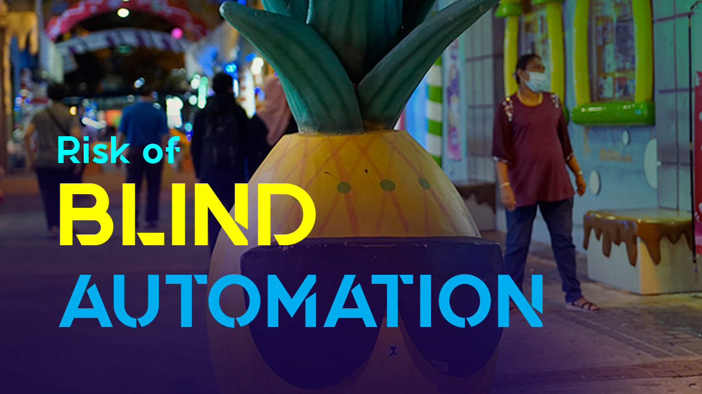

## When the Tools Start Thinking for You
It’s easy to see why AI has made its way into trading.
Machine learning models promise to analyze more data than a human ever could. They can spot patterns, generate entry signals, and even write code to automate strategies. With a few clicks, you can spin up a trading bot that claims to be smarter, faster, and more accurate than anything you could design by hand.
For traders tired of screen time and emotional decisions, it sounds like a dream.
But here’s the problem.
Most traders using AI aren’t using it to assist their thinking. They’re using it to replace it.
That’s where things go wrong.

## What Happens When You Rely on Vibes, Not Context
AI tools can now generate entire Pine Script or Python trading bots with a single prompt. You type in a vague idea, and it spits out a working script.
It might look clean. It might backtest well. It might even place a few decent trades.
But under the surface, you don’t know why it works. Or if it even works for the market you’re in.
You’re not building a strategy anymore. You’re just using someone else’s logic — copied, repackaged, and abstracted through layers of code you didn’t write and don’t fully understand.
That’s not trading. That’s vibe coding.
It’s relying on something that feels smart because it looks smart. But there’s no context, no real insight into price action, and no connection to the actual structure of the market.
And when things shift — when the trend breaks or volatility changes — you’re flying blind.
## False Positives Look Like Wins… Until They Don’t
One of the biggest risks with AI-generated strategies is the illusion of effectiveness.
A backtest might show a 70+% win rate. You see smooth equity curves and low drawdowns. But what you’re looking at might be curve-fitted, cherry-picked, or over-optimized for a narrow slice of data.
It’s easy to create a strategy that performs well on paper. It’s much harder to design one that adapts to real market conditions — news, macro trends, liquidity shifts, or human behavior.
AI doesn’t care about these factors unless you explicitly feed them into the system. And most traders don’t.
They’re trusting outputs from models trained on price alone. No fundamentals. No order flow. No market psychology.
And in real-world trading, those missing inputs matter.
The result? Strategies that perform well for a few days or weeks, then collapse without warning. And when that happens, you’re left with code you can’t fix and trades you can’t explain.

## The Real Power of AI Is in Enhancement, Not Replacement
AI isn’t the enemy. In fact, it can be a powerful partner — if you know how to use it.
The danger is in treating it like a magic black box that can outsmart the market on its own. It can’t.
The strongest traders use AI to speed up analysis, generate ideas, or automate repetitive tasks. But they never stop thinking. They don’t outsource the core decision-making. They treat AI like a tool, not a substitute for skill.
That’s the difference between responsible automation and blind delegation.
Because when you don’t understand your own system, you’re not trading. You’re just pushing buttons and hoping the model gets it right.
And hope isn’t a strategy.
## The Bottom Line
If you're using AI in your trading, be honest with yourself:
- Do you understand the logic behind your strategy?
- Can you explain why it wins — and why it might lose?
- Are you trading a system, or are you trusting a script you didn’t write?

The future of trading will include AI. That’s inevitable. But the traders who last are the ones who combine it with real insight, real discipline, and real understanding.

Anything less is gambling with prettier code.
