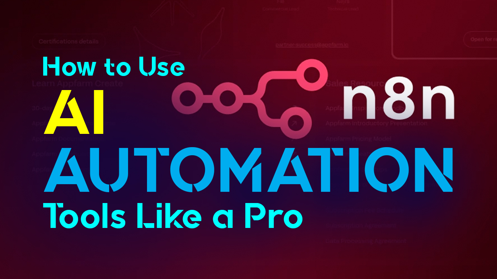

## How to Use AI Automation Tools Like a Pro: A Guide for Professionals, Virtual Assistants, and Modern Teams
In today’s fast-paced world, juggling tasks, staying productive, and scaling your work without burning out has become a science — and **AI automation** is at the heart of it.

Whether you’re a **virtual assistant**, a **freelancer**, a **startup founder**, or someone trying to reclaim their weekends from endless admin work, AI isn’t just a buzzword anymore. It’s your **most reliable coworker** — if you know how to use it.

Let’s dive into how you can **use AI automation tools like a pro**, and finally make the machines work for you.

## Everyone's Busy, But Few Are Efficient
You’re booking client meetings manually. Your inbox is a battlefield. You’re copying content from spreadsheets into emails like it’s 2008.

Sound familiar?

Professionals across industries — from finance and marketing to customer support and solopreneurs — face the same bottleneck: repetitive, low-impact tasks eating up high-impact hours.

And that’s where AI automation tools come in.

## Tools Without Strategy = Digital Clutter
Sure, you’ve tried ChatGPT. Maybe even n8n, Zapier, Notion AI, or a no-code tool that promised to automate your life. But here’s the catch:

> "Without a clear strategy, automation becomes just another layer of complexity."

Many professionals make the mistake of using automation tools as standalone magic tricks rather than part of a **workflow ecosystem**. They expect the AI to **“just know”** what to do — and end up frustrated when it doesn’t.

## Think Like an Architect, Not a Magician
### 1. Define Your Repetitive Pain Points
Start by listing your daily or weekly repetitive tasks:

- Email follow-ups
- Data entry
- Meeting scheduling
- Social media posting
- Document summarization

These are perfect candidates for automation.

### 2. Pick the Right AI Tools for the Job
Here’s how professionals and VAs are using them today:

| Use Case	| Recommended Tool |
| - | - |
| Email summarization	| ChatGPT + Gmail plugin| 
| Client onboarding workflows	| Zapier or Make + Google Forms| 
| Scheduling and availability	| Calendly + AI scheduling assistants| 
| Research + content creation	| ChatGPT, Claude, Notion AI| 
| CRM and task automation	| n8n + Airtable or Trello integrations| 
| Invoice generation	| Make + Google Sheets + PDF tools| 

Bonus: Tools like **n8n** let you **build your own workflow logic** with custom triggers and API integrations — like a self-hosted Zapier with developer superpowers.

### 3. Start Small, Scale Smart
You don’t need a 25-step automation on day one. Start with a simple win — like auto-sending a Slack message when a new task is added to Trello — and expand as you go.

Treat AI as a **team member**: train it, give it boundaries, and continuously improve its role.

### 4. Think Beyond Tasks — Think Systems
Combine AI with API integrations to build **end-to-end systems**, like:

- Automated lead capture → enrichment → CRM entry
- Content generation → image creation → social media scheduling
- Support ticket intake → AI draft response → human approval → email sent
That’s not automation. That’s leverage.

## Will AI Replace Your Job?
No — but it will replace professionals who don’t learn how to use it.

Virtual assistants who can operate AI tools will **outperform and outscale** those who can't. Developers who integrate automation into client projects will ship faster and charge more. Founders who automate operations will grow lean and smart.

The winners won’t be those who fear AI — they’ll be the ones who **delegate to it intelligently**.

## Final Thoughts: Build Your AI Stack With Purpose
You don’t need to become a machine learning expert. You just need to think like a systems engineer: identify friction, connect tools, and let AI handle the rest.

> “Automate the boring, so you can focus on the brilliant.”

So whether you’re managing a growing business, freelancing full-time, or just tired of manually copying data into spreadsheets — there’s an AI for that. And you’re just one workflow away from reclaiming your time.

#### ✨ Want help designing your own AI automation workflow?
Reach out — I can help you design and implement custom AI-powered systems using tools like ChatGPT, n8n, Python, or Go.