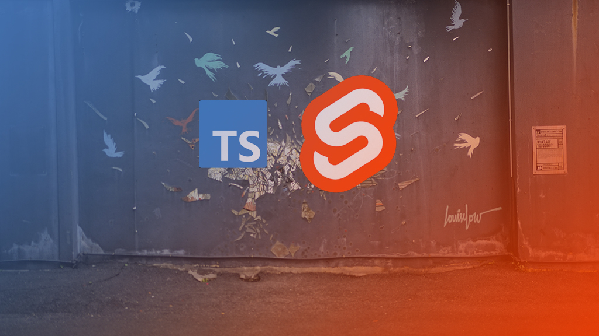

In the fast-paced world of frontend development, Svelte has emerged as a breath of fresh air, combining simplicity with power. When paired with TypeScript, Svelte becomes an even more formidable tool, offering type safety and enhanced developer experience. Meanwhile, SvelteKit, the full-stack application framework for Svelte, outshines its counterparts like React and Vue.js in many ways. Let’s dive into why TypeScript in Svelte is a game-changer and explore the beauty of SvelteKit compared to other popular JavaScript frameworks.


## **Why I Love TypeScript in Svelte**

### **1\. Type Safety Without the Noise**

Svelte’s inherently simpler structure pairs beautifully with TypeScript. Defining props, types, and interfaces feels natural and uncluttered compared to other frameworks. The combination helps catch errors early while keeping your codebase clean and maintainable.

**Example: A Simple User Component**

Imagine building a component to display user profiles. With TypeScript, you can define clear expectations for the props:

```typescript
<script lang="ts">
export interface User {
   id: number;
   name: string;
   email: string;
}
export let user: User;
</script>

<div>
    <h2>{user.name}</h2>
    <p>Email: {user.email}</p>
</div>
```

In a real-world scenario, this ensures that only valid user data is passed to the component, preventing runtime errors when fetching or rendering user data from APIs.

### **2\. Intuitive Syntax with Powerful Typing**

Unlike JSX or Vue templates, Svelte’s HTML-first approach means you’re writing declarative code that feels intuitive, with TypeScript enhancing it by enforcing data consistency. This reduces cognitive load while working on complex applications.

**Example: A Todo App**

With TypeScript, you can define the structure of your to-dos and ensure type safety throughout:

```typescript
<script lang="ts">
  interface Todo {
    id: number;
    title: string;
    completed: boolean;
  }
  let todos: Todo[] = [
    { id: 1, title: 'Learn Svelte', completed: false },
    { id: 2, title: 'Build a project', completed: false }
  ];
  function toggleCompleted(id: number) {
    todos = todos.map(todo =>
      todo.id === id ? { ...todo, completed: !todo.completed } : todo
    );
  }
</script>
<ul>
  {#each todos as todo}
    <li>
      <input type="checkbox" bind:checked={todo.completed} on:change={() => toggleCompleted(todo.id)} />
      {todo.title}
    </li>
  {/each}
</ul>
```

This example demonstrates a small but functional application where TypeScript ensures the consistency and integrity of your data.

### **3\. Improved Tooling**

With TypeScript, Svelte’s already excellent tooling gets a significant boost. Autocompletion, type-checking, and error detection within IDEs like VS Code ensure you’re more productive and confident in your work. For example, if you mistype a property name in the `Todo` interface, your IDE will highlight the error immediately.

### **4\. Seamless Integration**

Using TypeScript in Svelte requires minimal configuration. The community has ensured a smooth developer experience, making it easy to adopt and enjoy TypeScript’s benefits without extensive setup.

**Real-World Scenario: API Integration**

When fetching data from an external API, TypeScript can define the expected structure, preventing potential issues:

```typescript
<script lang="ts">
  import { onMount } from 'svelte';
  interface Post {
    id: number;
    title: string;
    body: string;
  }
  let posts: Post[] = [];
  onMount(async () => {
    const response = await fetch('https://jsonplaceholder.typicode.com/posts');
    posts = await response.json();
  });
</script>
<ul>
  {#each posts as post}
    <li>
      <h3>{post.title}</h3>
      <p>{post.body}</p>
    </li>
  {/each}
</ul>
```

This ensures that your `posts` variable matches the expected structure, and any discrepancies are caught at compile time rather than runtime.

## **The Beauty of SvelteKit Compared to React and Vue.js**

### **1\. Zero Boilerplate**

Unlike React (with Next.js) or Vue.js (with Nuxt.js), SvelteKit provides a much cleaner starting point. The lack of excessive boilerplate code means developers can focus on building features rather than managing configuration.

**Example: File-Based Routing**

SvelteKit’s file-based routing is straightforward and intuitive. For instance, creating a new route is as simple as adding a file in the `routes` directory:

```bash
src/routes
├── index.svelte
├── about.svelte
├── blog
│   └── [slug].svelte
```

This simplicity reduces setup time and improves developer productivity.

### **2\. Truly Reactive**

While React and Vue.js employ reactivity via hooks or computed properties, Svelte’s reactivity is built into its core. Variables automatically update the DOM when they change, making the code more intuitive and less verbose.

**Example: Dynamic Form Handling**

```typescript
<script>
  let formData = { name: '', email: '' };
  function handleSubmit() {
    console.log('Form submitted:', formData);
  }
</script>
<form on:submit|preventDefault={handleSubmit}>
  <input type="text" bind:value={formData.name} placeholder="Name" />
  <input type="email" bind:value={formData.email} placeholder="Email" />
  <button type="submit">Submit</button>
</form>
```

This simplicity makes it easier to build dynamic and interactive applications.

### **3\. Built-In Optimizations**

SvelteKit’s approach to rendering — whether it’s SSR (Server-Side Rendering), SSG (Static Site Generation), or client-side — is seamless and highly performant out of the box. This contrasts with the sometimes-cumbersome configurations required in React and Vue.js ecosystems.

### **4\. Smaller Bundle Sizes**

Svelte’s compiler approach eliminates the runtime overhead common in React and Vue.js, resulting in significantly smaller bundle sizes and faster load times. For businesses, this translates into better SEO and user retention.

### **5\. Simplified State Management**

State management in Svelte is refreshingly straightforward, with no need for additional libraries like Redux or Vuex. Svelte’s writable stores provide a lightweight, built-in solution for managing global state.

**Example: Shared State Across Components**

```typescript
// store.ts
import { writable } from 'svelte/store';
export const count = writable(0);

<!-- Counter.svelte -->
<script>
  import { count } from './store';
</script>

<button on:click={() => count.update(n => n + 1)}>Increment</button>
<p>Count: {$count}</p>
```

This simplicity is a significant advantage for teams and solo developers alike.

## **Why Choose SvelteKit and TypeScript?**

The combination of SvelteKit and TypeScript represents the best of both worlds — a modern framework designed for simplicity and speed, paired with a robust type system that ensures reliability and scalability. Whether you’re building a personal project or a production-grade application, this stack is worth considering.

What’s your experience with SvelteKit and TypeScript? Let’s discuss in the comments below!