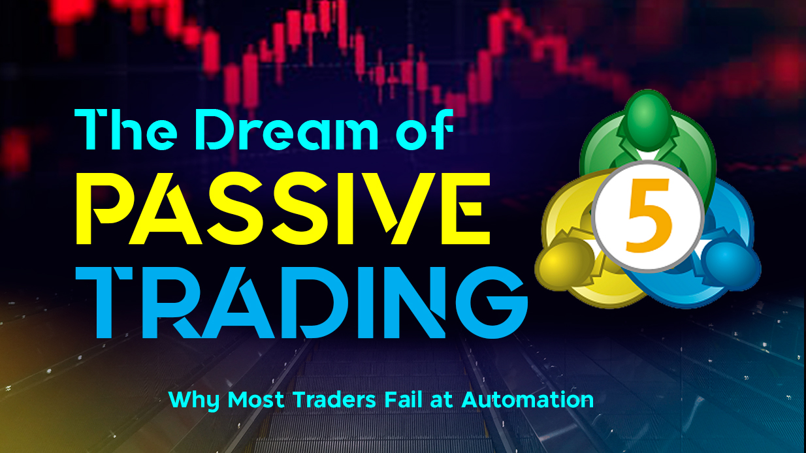

## **The Dream of Passive Trading**

It usually starts with a dream. You’ve developed a strategy, maybe it’s a clean RSI divergence setup or a price action pattern you’ve been back testing for weeks. It works. You’re winning more than you’re losing.

Then it hits you: *"Why not automate it?"*

The idea sounds perfect. No more missed entries, no more late nights waiting for confirmations and confluences. Just signals, entries, exits, all running 24/7 while you sleep, work, or go for a walk. You start coding. Pine Script handles the signals. A webhook sends the alert. Maybe you use a Python script or even a vibe-coding bridge to place the order.

Within a day or two, your first trade gets triggered. Your bot is alive. And you feel like a genius.

But then… things go wrong.

---

## **Why It Falls Apart**

At first, you shrug off the issues. A missed entry? Maybe the alert was delayed. A double trade? Maybe the position hit the stop-loss too early, or maybe it didn’t even close when it should have. Perhaps you accidentally ran two instances of your bot.

But the cracks begin to grow.

You start noticing inconsistencies, trades don’t execute at the right time, or worse, at the wrong price. Some days, you get no trades at all, even though your setup clearly triggered.

Other times, your broker rejects orders because your bot didn’t handle position sizing properly. And when you try to trace the issue?

You realize you never added logging.

You built something, sure. But it’s blind, brittle, and behaving unpredictably. And the worst part? You don’t even know where it’s failing, let alone why.

This is where most traders quit. They realize that automation isn’t as plug-and-play as it looks. What they thought was just “code + strategy = freedom” turns out to be a deeper, more complex problem. One that’s less about trading and more about **software engineering**.

---

## **How Engineers Think Differently**

Here’s the good news: if you have even a bit of engineering experience, or you’re willing to think like one — you can turn this mess into something powerful.  
Because unlike many traders who approach automation as a shortcut, engineers approach it as **a system to be designed, tested, and improved**.

The first shift is in how you structure the bot itself. Most hobbyist traders will build everything inside a single, messy script — one that receives alerts, calculates position size, sends orders, and maybe prints a log to the terminal. But engineers know better. Systems are easier to scale, test, and debug when you break them into modules. You don’t need microservices out of the gate, but you do need separation of concerns. Have one function handle signals, another manages risk logic, another for execution, and another to monitor and log the results.

The next big shift is how you treat the signals. Many traders think a webhook alert should instantly trigger a trade. But as an engineer, you realize that a webhook is an event, not a command. When you receive that signal, you should run it through a series of checks. Is the market open? Are we already in a trade? Has slippage widened too much? Did this alert already trigger at the last minute?

Your system should decide whether it’s safe, and smart to act. This is the automation equivalent of **if-else logic in the real world**. Not all signals should be followed blindly.

Of course, none of these matters if your system can’t recover from failure. APIs fail. Connections drop. Brokers reject orders. Your bot must not only expect these issues, but it should also handle them gracefully. If an order doesn’t go through, try again. If MT5 is disconnected, queue the trade or trigger an alert. Always log the reason. Build in redundancy like an engineer deploying backend infrastructure, because that’s exactly what you’re doing.

Lastly, visibility is everything. Without logs, metrics, and some form of monitoring, you’ll never trust your automation. You don’t need Prometheus and Grafana from day one, but you do need clear, timestamped logs of every signal received, trade executed, error handled, and position updated. Even a simple .log file and Telegram alerts can give you a massive edge when debugging.

---

## **A Real-World Example: From Script to System**

When I built my first bot, I started with a Python script that simply caught **TradingView** webhooks and sent market orders to MT5. It worked, until it didn’t.

So, I refactored. I broke it into modules: one script received signals and validated the logic. Another handled risk calculations. The third was in charge of execution, retries, and order status tracking. I wrapped the whole thing in a basic **FastAPI** server and added a logging layer that wrote to both file and Telegram.

Later, I migrated the core to Golang, not because Python wasn’t working, but because I wanted tighter control over concurrency and WebSocket handling. Using goroutines and channels, I could process multiple signals and order flows in real time without blocking anything. It felt like engineering, not just coding.

And when something failed, I didn’t panic. I read the logs, identified the bug, wrote a test, and fixed it. Just like I would in any other production environment.

---

## **Final Thoughts: Automation Isn’t a Hack — It’s an Engineering Problem**

If you're thinking about building a trading bot, or you’ve already built one that behaves like a wild animal, know this:

You're not failing because your strategy is bad (or maybe).  
You're failing because your automation wasn’t built like software.

And if you start thinking like an engineer, with modular code, fault tolerance, monitoring, and system design, you’ll build bots that are stable, repeatable, and genuinely hands-off.

Not every strategy will make money.  
But every good system should work exactly as designed, even when it fails.

And that, more than anything, is how you win in trading automation.

---

## 🤝 Need Help Automating Your Strategy?

With over 13 years of experience in software engineering, building scalable, enterprise-grade systems, and a deep trading mindset, I help traders turn their strategies into fully automated bots using **Expert Advisors**, **Python**, or **Go**.

If you’re ready to bring your idea to life, I’d be happy to help.  
📩 Reach out to me at **nenjotrade@gmail.com** and let’s build it right.