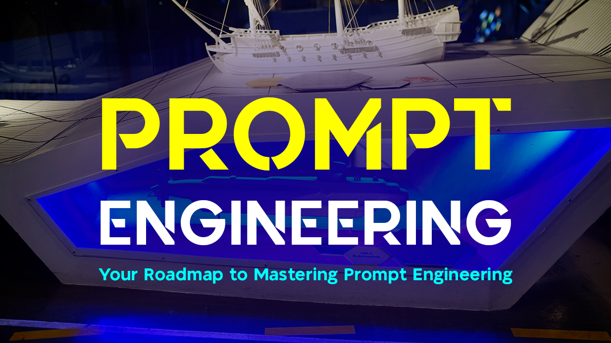

Most people treat AI like a magic box: you type something in, and it spits something out. But here’s the twist—two people can ask the exact same AI for help, and one will get a brilliant, nuanced response while the other gets something flat, shallow, or even wrong. Why? The difference lies not in the AI itself, but in the prompt.

Prompt engineering is about bridging the gap between human intention and machine interpretation. It’s the craft of communicating with AI so effectively that it feels less like giving instructions to a tool and more like collaborating with a colleague.

This roadmap is designed to guide you—step by step—through mastering prompt engineering. Think of it as learning a new language. At first, it’s clumsy. Over time, you begin to notice patterns, subtleties, and techniques that unlock an entirely new level of fluency.

## **Stage 1: Understanding the Basics**

The first step is grasping that AI doesn’t “know” anything in the way we do. Large Language Models (LLMs) like GPT are statistical engines: they predict the next most likely word based on your prompt.

That means your instructions are everything.

For example, say you ask:
- “Explain quantum physics.”
You’ll likely get a dense, textbook-style explanation.
- “Explain quantum physics like I’m 10 years old.”
Suddenly, you get metaphors, analogies, and storytelling.
- “Act as Richard Feynman explaining quantum physics in a playful lecture.”
Now you’ve invoked tone, style, and persona—all with a single prompt.

This is the starting point: realizing that the way you frame the question changes the answer entirely.

## **Stage 2: Learning Prompt Structures and Frameworks**

Once you’ve grasped the basics, the next milestone is learning frameworks—repeatable patterns that consistently improve AI responses.

Here are some foundational ones:

- **Zero-shot prompting**
Simply asking the question without examples. Good for general use.
- **Few-shot prompting**
Providing examples within the prompt so the AI learns the format you want. Example:
“Translate the following sentences into Spanish.
  1. Hello → Hola
  2. Good night → Buenas noches
  3. Where is the train? → ?”
- **Chain-of-thought prompting**
Encouraging the AI to show its reasoning step by step.
“Explain your reasoning before giving the final answer.”
- **Role prompting**
Assigning the AI a role improves focus.
“Act as a senior software engineer reviewing my Go code.”
- **Instruction hierarchy**
Breaking down big tasks into smaller instructions:
“First, generate 3 blog title ideas. Then, choose the best one. Finally, write a 200-word intro.”

Frameworks like these turn a vague conversation into a structured interaction.

## **Stage 3: Developing Precision and Clarity**

By now, you know how to structure prompts. The next stage is about refinement.
Good prompt engineers are ruthlessly clear. They:
- Avoid ambiguity
- Specify length, tone, and format
- Set constraints and rules

For example:
- ❌ Bad: “Write me something about finance.”
- ✅ Good: “Write a 500-word blog post explaining compound interest to beginners using metaphors, a casual tone, and at least one real-life example.”

This is where you stop being a casual AI user and start acting like a director giving precise stage directions.

## **Stage 4: Going Beyond Text — Tools, Agents, and Workflows**

At some point, prompts aren’t just about asking for text. They’re about **orchestrating workflows**.

This is where tools like **LangChain, LangGraph, n8n, and MCP (Model Context Protocol)** come in. These platforms let you:

- Chain prompts together into multi-step flows
- Call external APIs (like fetching live stock prices)
- Connect AI with vector databases for long-term memory (RAG: Retrieval-Augmented Generation)
- Enable **Agent-to-Agent (A2A)** conversations where multiple AIs collaborate

For example, instead of prompting GPT to “summarize this PDF,” you could:
1. Upload the document to a vector database.
2. Use LangChain to query specific sections.
3. Automate summaries with n8n workflows.

Here, prompt engineering blends into **AI automation**—where prompts are no longer one-off instructions but parts of entire systems.

## **Stage 5: Applying Prompt Engineering to Real Problems**

Theory is worthless without application. The next level is solving real-world challenges with prompts.

- **For developers**: Debugging code by asking the AI to explain errors step by step.
- **For traders**: Designing Pine Scripts or backtests by guiding the AI to follow market rules.
- **For content creators**: Automating blog drafts, titles, and SEO descriptions.
- **For analysts**: Summarizing huge datasets with structured prompts.

The trick is **iterative refinement**: try, test, adjust, repeat. Each failure teaches you what the AI misunderstands—and how to prompt better.

## **Stage 6: Building a Prompting Mindset**

Here’s the surprising part: mastering prompt engineering isn’t about memorizing tricks. It’s about shifting your thinking.

Instead of asking, “What can AI do for me?” you start asking, “How do I clearly communicate my intent?”

It’s the same skill that makes great teachers, writers, or leaders: clarity, structure, and empathy for the listener. Except here, your “listener” is a machine.

This mindset unlocks creativity. You begin to:

- Experiment with styles (poetic, analytical, humorous)
- Combine multiple frameworks (few-shot + role + chain-of-thought)
- Treat AI like a collaborator, not just a tool

## **Stage 7: Staying Ahead**

AI models evolve. Prompting techniques that work today may not tomorrow. That’s why continuous learning is the final stage.

- Follow research papers on prompting methods.
- Experiment with new frameworks like Self-Consistency or Tree-of-Thoughts.
- Engage with communities—Reddit, Discord, Twitter/X—where prompt hackers share breakthroughs.

> Remember: prompt engineering is not static. It’s like learning photography—you start with basic composition, but the art evolves as tools and techniques change.

## The Takeaway

Your roadmap looks like this:

1. Understand the basics
2. Learn structures and frameworks
3. Develop precision and clarity
4. Move into tools and workflows
5. Apply to real-world problems
6. Build a prompting mindset
7. Stay ahead of the curve

At its heart, prompt engineering is less about manipulating AI and more about refining your own communication skills. It’s a mirror: the clearer you are, the clearer the machine becomes.

Master it, and you won’t just get better outputs—you’ll transform the way you think, create, and solve problems in the age of AI.